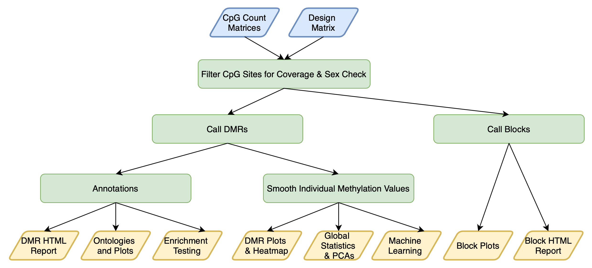

# DMRichR 

<!-- badges: start -->
[](https://ben-laufer.github.io/DMRichR/actions)
<!-- badges: end -->

Enrich Your Differentially Methylated Region (DMR) Analysis with the Tidyverse

**Website:** [ben-laufer.github.io/DMRichR/](https://ben-laufer.github.io/DMRichR/)

## Overview

`DMRichR` is an executable and R package for the statistical analysis and visualization of differentially methylated regions (DMRs) from CpG count matrices, which can be obtained from [Bismark cytosine reports](https://github.com/FelixKrueger/Bismark/tree/master/Docs#optional-genome-wide-cytosine-report-output). If you have not yet generated these files, they can also be obtained through the [CpG_Me pipeline](https://github.com/ben-laufer/CpG_Me).

The goal of `DMRichR` is to make the comprehensive statistical analysis of whole genome bisulfite sequencing (WGBS) data accessible to the larger epigenomics community, so that it no longer remains a niche methodology. Whether it be peripheral samples from a large-scale human epidemiological study or a select set of precious samples from model and non-model organisms, WGBS can provide novel insight into the epigenome and its role in the regulation of gene expression. Furthermore, the functions and workflow are written with the goal of bridging the gap for those transitioning from Illumina's Infinium assay technology (450K and EPIC arrays) by providing statistical analysis and visualization functions that present the data in a familiar format. 

The overarching theme of `DMRichR` is the synthesis of popular [Bioconductor](https://bioconductor.org) R packages for the analysis of genomic data with the [tidyverse](https://www.tidyverse.org) philosophy of R programming. This allows for a streamlined and tidy approach for downstream data analysis and visualization. In addition to functioning as an R package, the central component of DMRichR is an [executable script](https://github.com/ben-laufer/DMRichR/blob/master/exec/DM.R) that is meant to be run as a single call from command line. While this is a non-traditional approach for R programming, it serves as a novel piece of software that simplifies the analysis process while also providing a backbone to build custom workflows on (in a manner similar to a traditional vignette). `DMRichR` also works as a traditional R package with a number of novel [functions](https://ben-laufer.github.io/DMRichR/reference/index.html). 

A single command line call performs the following steps:


## Installation

No manual installation of R packages is required, since the required packages and updates will occur automatically upon running the [executable script](https://github.com/ben-laufer/DMRichR/blob/master/exec/DM.R) located in the `exec` folder. However, you can install the package using:

```
if(!requireNamespace("BiocManager", quietly = TRUE))
  install.packages("BiocManager")
if(!requireNamespace("remotes", quietly = TRUE))
  install.packages("remotes")
Sys.setenv("R_REMOTES_NO_ERRORS_FROM_WARNINGS" = TRUE)
BiocManager::install("ben-laufer/DMRichR")
```

macOS users will have to install XQuartz [manually](https://www.xquartz.org) or through [Homebrew](https://brew.sh) using `brew install xquartz --cask`. Finally, while DMRichR works with R 4.0, the parallelization works best with R 3.6.

## Website Table of Contents
1. [DMR Approach and Interpretation](https://ben-laufer.github.io/DMRichR/articles/DMRichR.html#dmr-approach-and-interpretation)
3. [Input](https://ben-laufer.github.io/DMRichR/articles/DMRichR.html#input)
      1. [Design Matrix and Covariates](https://ben-laufer.github.io/DMRichR/articles/DMRichR.html#the-design-matrix-and-covariates)
      2. [Cytosine Reports](https://ben-laufer.github.io/DMRichR/articles/DMRichR.html#cytosine-reports)
3. [Running DMRichR](https://ben-laufer.github.io/DMRichR/articles/DMRichR.html#running-dmrichr)
      1. [Generic Example](https://ben-laufer.github.io/DMRichR/articles/DMRichR.html#generic-example)
      2. [UC Davis Example](https://ben-laufer.github.io/DMRichR/articles/DMRichR.html#uc-davis-example)
4. [Workflow and Output](https://ben-laufer.github.io/DMRichR/articles/DMRichR.html#workflow-and-output)
      1. [Process Cytosine Reports](https://ben-laufer.github.io/DMRichR/articles/DMRichR.html#1-process-cytosine-reports)
      2. [Blocks](https://ben-laufer.github.io/DMRichR/articles/DMRichR.html#2-blocks)
      3. [DMRs](https://ben-laufer.github.io/DMRichR/articles/DMRichR.html#3-dmrs)
      4. [Smoothed Individual Methylation Values](https://ben-laufer.github.io/DMRichR/articles/DMRichR.html#4-smoothed-individual-methylation-values)
      5. [ChromHMM and Roadmap Epigenomics Enrichments](https://ben-laufer.github.io/DMRichR/articles/DMRichR.html#5-chromHMM-and-roadmap-epigenomics-enrichments)
      6. [Global Methylation Analyses and Plots](https://ben-laufer.github.io/DMRichR/articles/DMRichR.html#6-global-methylation-analyses-and-plots)
      7. [DMR Heatmap](https://ben-laufer.github.io/DMRichR/articles/DMRichR.html#7-dmr-heatmap)
      8. [DMR Annotations](https://ben-laufer.github.io/DMRichR/articles/DMRichR.html#8-dmr-annotations-and-dmrichments)
      9. [Manhattan plot](https://ben-laufer.github.io/DMRichR/articles/DMRichR.html#9-manhattan-plot)
      10. [Gene Ontology Enrichments](https://ben-laufer.github.io/DMRichR/articles/DMRichR.html#10-gene-ontology-enrichments)
      11. [Machine Learning](https://ben-laufer.github.io/DMRichR/articles/DMRichR.html#11-machine-learning)
      12. [Cell Composition Estimation](https://ben-laufer.github.io/DMRichR/articles/DMRichR.html#12-cell-composition-estimation)
      13. [RData](https://ben-laufer.github.io/DMRichR/articles/DMRichR.html#13-RData)
5. [Publications](https://ben-laufer.github.io/DMRichR/articles/DMRichR.html#publications)
6. [Acknowledgements](https://ben-laufer.github.io/DMRichR/articles/DMRichR.html#acknowledgements)
